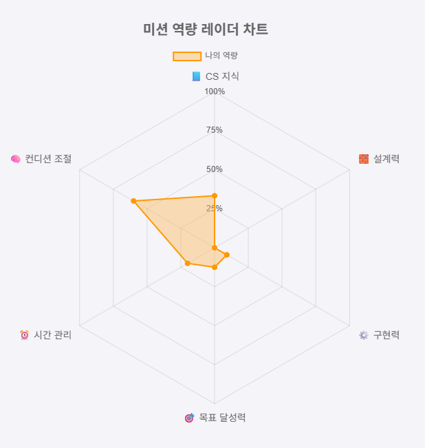
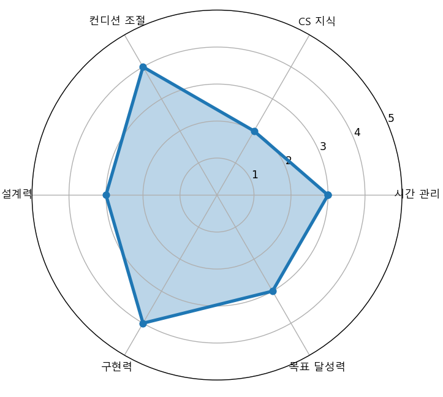
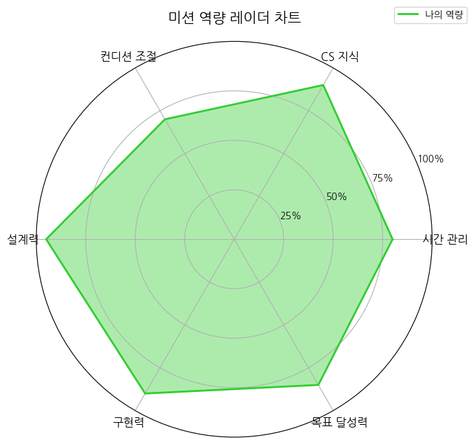
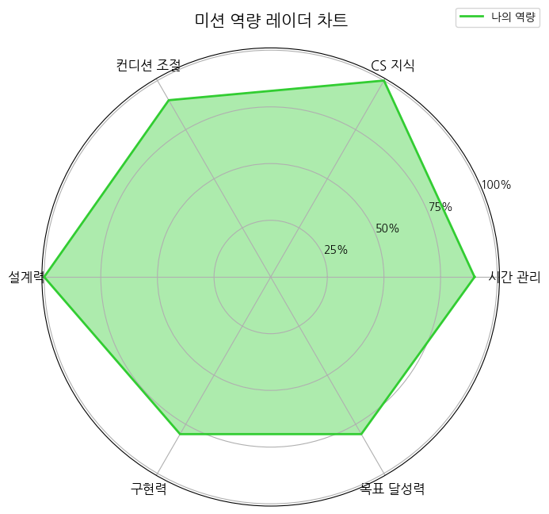
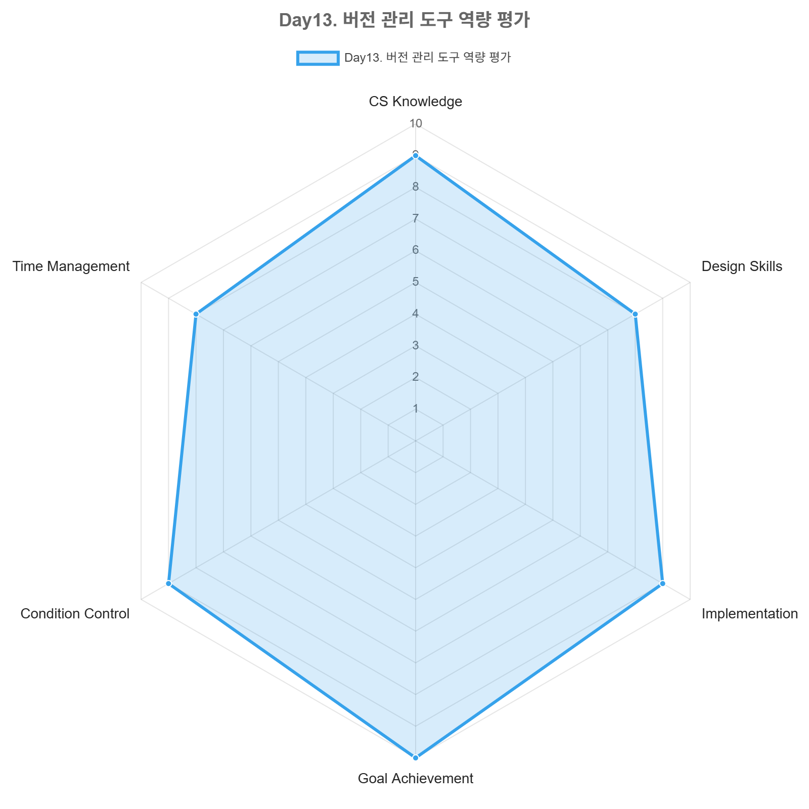

J014, J046, J120, K021

<details>
<summary>퀘스트 1</summary>
   
# 하루 미션: 육각형 성장 퀘스트 - 하루 핵심 역량 집중 + 성장 확인

## 분석

- 개발자로 성장하기 위해서는 다양한 역량(Time Management, CS Knowledge, Condition Control, Design Skills, Implementation, Goal Achievement)이 균형 있게 발전해야 한다.
- 그러나 하루 동안 모든 역량을 고르게 올리는 것은 현실적으로 어렵다.
- 따라서 **매일 하나의 핵심 역량에 집중하고**, 하루가 끝난 후 **그 역량이 실제로 성장했는지 확인**하는 루틴이 필요하다.

## 목적

- 매일 목표 역량을 명확하게 설정하여 **의식적 성장(Deliberate Practice)**을 실천한다.
- 하루 활동을 돌아보며 **객관적인 자기 피드백**을 습관화한다.
- 시각화(레이더 차트)를 통해 **성장의 변화를 눈으로 확인**한다.

## 퀘스트 수행 방법

1. **하루 시작 시 핵심 역량 선택**
   - 6가지 항목 중 오늘 가장 집중하고 싶은 역량 1가지를 고른다.  
     예: `오늘은 CS Knowledge에 집중한다.`
2. **미션 진행하는 동안 집중 실천**
   - 선택한 역량과 관련된 목표를 하루 동안 의식적으로 실천한다.
3. **하루 마무리 점검**
   - 육각형 레이더 차트(1~5점)에 오늘의 각 역량 점수를 기록한다.
   - 특히 선택한 핵심 역량에 대해 **“실제 성장했는가?”**를 평가하고, 한줄 회고를 남긴다.

## 달성 기준

- **핵심 역량 1개를 선택하고 집중 실천 기록 완료**
- **6가지 항목 모두 자기 점수 기록(1~5점)**
- **한줄 회고 작성 (예: “CS 지식은 성장했지만 시간 관리가 부족했다.”)**

## 기대 효과

- 하루 단위로 **“성장 포인트”**를 명확히 인식할 수 있다.
- **육각형 차트**를 활용하여 불균형한 역량을 객관적으로 파악하고 조정할 수 있다.
- 개발자로서의 **핵심 역량을 게임처럼 키우는 재미와 동기부여**를 제공한다.
- 꾸준한 루틴으로 **작은 성취가 누적되어 장기 성장**을 이끈다.

좋아! 아래는 "**그래프를 AI에게 보여주고 개선점 물어보기**" 퀘스트를 `분석 → 목적 → 수행 방법 → 달성 기준 → 기대 효과`로 구조화한 내용이야.

</details>

<details>
<summary>퀘스트 2</summary>

## 🎯 **퀘스트명: AI 피드백 기반 개선 퀘스트 - “그래프에게 묻다”**

### 🔍 **1. 분석**

- 육각형 그래프는 자기 회고 기반으로 생성된 **정량적 성장 지표**입니다.
- 그러나 점수를 보는 것만으로는 **구체적인 개선 방향**을 잡기 어려울 수 있음.
- AI는 회고 텍스트와 점수의 상관관계를 이해하고, **개인 맞춤 피드백**을 제공할 수 있는 도구입니다.

### 🎯 **2. 목적**

- 점수 기반 피드백을 AI로부터 받아 **구체적인 개선 방안과 다음 행동 목표**를 설정
- 낮은 점수에 대한 원인 분석과 **실행 가능한 전략 수립**
- **감정적 주관** 대신 **객관적 가이드를 제공**받아 성장 루틴을 강화

### 🛠️ **3. 퀘스트 수행 방법**

1. **회고 텍스트 + 육각형 그래프 점수표**를 GPT에게 입력
   (예시: `"오늘 회고는 이렇고, 점수는 다음과 같습니다. 어떻게 개선하면 좋을까요?"`)

2. GPT가 각 항목별로 분석하여 **개선 포인트와 실천 팁**을 제안
   (예시: `⏰ 시간 관리: 너무 많은 목표 설정 → 작은 단위로 쪼개기 추천`)

3. 제안 중 마음에 드는 **1\~2개 액션을 선택**하여 **내일 적용 계획 수립**

4. 다음날 회고에 **실행 여부 및 효과** 기록

### 🎯 **4. 달성 기준**

- 육각형 그래프 및 회고를 기반으로 GPT에게 피드백을 요청
- AI 피드백 중 1개 이상을 **명시적으로 적용**
- 다음날 회고에 적용 결과 또는 변화를 **텍스트로 남김**

### ✨ **5. 기대 효과**

- 육각형 그래프의 수치가 **단순 결과가 아닌 개선의 출발점**이 됨
- 반복적으로 AI 피드백을 반영함으로써 **맞춤형 성장 루틴 정착**
- 점수와 회고의 연결성을 높여 **정성적 회고 → 실천 → 정량 개선**이라는 선순환 구축
- 팀원에게도 추천 가능 → **함께 성장하는 문화 촉진**

</details>

<details>
<summary>퀘스트 3</summary>

# 하루 미션: 코드 로그 기반 육각형 성장 분석 퀘스트

## 분석

- 개발자의 하루는 여러 역량(Time Management, CS Knowledge, Condition Control, Design Skills, Implementation, Goal Achievement)의 조합으로 구성된다.
- 이 역량들이 언제, 얼마나 발휘되었는지는 gist 등의 코드 푸시 기록을 통해 일정 부분 정량적으로 추적 가능하다.
- 따라서 하루 동안의 gist push 로그를 수집/분석하여 각 시간대의 활동 역량을 평가하고, 가장 집중이 잘 된 시간대를 도출해보는 퀘스트가 유용하다.

## 목적

- 코드 기록 기반의 역량 추적으로 객관적인 피드백 확보
- 시간대별 집중도를 파악하여 자신의 최적 작업 시간대 인식
- 반복 학습과 분석을 통해 의식적 성장(Deliberate Practice) 루틴 완성

## 퀘스트 수행 방법

1. Gist 작업 로그 수집

- 하루 동안 gist에 push한 기록 시간(Push Timestamp)들을 수집한다.
- 각 push마다 내용(또는 파일명, 커밋 메시지 등)을 간략히 요약한다.

2. 6가지 역량으로 분류
   각 푸시 기록을 아래 6개 항목 중 가장 적절한 역량에 매핑한다:

- Time Management: 계획적 작업, 일정 관리, 루틴 실천 등
- CS Knowledge: 알고리즘, 시스템, 네트워크 등 이론 기반 학습
- Condition Control: 휴식, 체력, 멘탈 관리, 리듬 조절 등
- Design Skills: UI/UX, 코드 아키텍처, 설계 개선 등
- Implementation: 실제 기능 구현, 코드 작성, 디버깅 등
- Goal Achievement: 특정 목표 달성, 마일스톤 완수 등

3. 시간대별 분석 및 시각화

- 시간대를 06~09, 09~12, 12~15, 15~18, 18~21, 21~24 등으로 나눈다.
- 각 시간대에 기록된 역량별 push 횟수를 분석한다.
- **육각형 차트(1~5점)**로 각 역량의 상대적 집중도를 시각화한다.

4. 집중 시간대 도출

- 푸시 활동이 가장 집중된 시간대를 추출하고, 어떤 역량이 강하게 작동했는지 파악한다.

5. 한줄 회고 작성

- 분석 결과를 바탕으로 하루를 돌아보고 한줄 회고 작성
  예: “Implementation이 오후에 몰렸고 집중도 최고. 내일은 CS 기반 설계에 오전 시간을 써보자.”

## 달성 기준

- gist 로그 기반으로 역량별 활동 시점 기록
- 시간대별 집중도 정량 분석
- 육각형 성장 차트 시각화
- 한줄 회고 작성

## 기대 효과

- 객관적인 로그 기반 피드백 루틴 구축
- 역량별/시간대별 생산성 인사이트 확보
- 장기적으로 자신의 리듬과 강점을 활용한 최적화 루틴 개발
- 개발 성장을 데이터 기반 RPG처럼 게임화

</details>

<details>
<summary>퀘스트 4</summary>

# 미션: 아침 셀프 컴파일링을 통한 육각형 성장 분석 퀘스트

## 분석

- 어제의 작업을 말로 정리하고 점검하는 **셀프 컴파일링(Self Compiling)**은 사고를 구조화하고, 어설픈 지점이나 설명 불가능한 설계를 바로 확인할 수 있는 강력한 루틴이다.
- 이 과정은 설계, 구현, 시간 사용, 몰입 상태 등을 스스로 되짚어보는 시간이 되며, 6가지 역량 기반의 정량/정성 점검에 적합하다.

## 목적

- 전날 작업의 논리, 설계, 구현 이유를 정리하며 구조적 복습
- 문제 해결 과정, 시간 사용, 목표 달성 등 역량별 상태 점검
- 점검 결과를 육각형 차트로 시각화해 불균형 파악 및 개선 루틴 정착

## 👍퀘스트 수행 방법

1. 아침 셀프 컴파일링 체크리스트에 “예/아니오”로 체크

   - [x] Thread 생성 방식 학습
   - [ ] 레이스 컨디션 구현 실험
   - [x] OperationQueue 동작 방식 학습
   - [x] EventManager 싱글톤 구현
   - [x] postEvent 비동기 구현

2. 해당 내용 복사 & 붙여넣기

   - AI한테 보내기

3. 체크된 항목을 다음과 같은 기준으로 분류/매핑 적용시키기

| 체크 항목                         | 관련 역량                           |
| --------------------------------- | ----------------------------------- |
| Thread/레이스 컨디션 학습 및 구현 | CS Knowledge, Implementation        |
| OperationQueue 학습               | CS Knowledge, Design Skills         |
| EventManager 구조 설계            | Design Skills, Implementation       |
| postEvent 구현(sync/async/delay)  | Implementation, Time Management     |
| 테스트 시나리오 직접 설계         | Goal Achievement, Condition Control |
| 조건별 Subscriber 로직 구현       | Design Skills, Implementation       |

4. 자동 점수화

   - 체크 수 또는 주관적 체감에 따라 각 항목에 1~5점 배정
     - 예시: “CS Knowledge 관련 체크 3개 → 4점”, “Goal 관련 없음 → 1점”

5. 육각형 차트 점수 기록
   - 위 점수를 기반으로 차트 시각화 또는 텍스트 저장

## 달성 기준

- 전날 작업 체크리스트 작성 및 예/아니오 체크 완료
- 체크된 작업들을 6가지 역량으로 매핑하고 점수 기록
- 핵심 역량 1개 선택 및 한줄 회고 작성
- 점수 기반 육각형 차트 시각화 또는 저장

## 기대 효과

- 매일의 작업을 구조화된 역량 프레임으로 해석함으로써 주관이 아닌 객관적 성장 추적 가능
- “많이 했는지”보다 **“무엇을 했고, 어떤 역량이 발휘됐는지”**를 중심으로 인식 전환
- 반복적으로 수행할수록 자신의 강점과 약점이 명확히 드러나고, 성장 루틴이 내재화됨
- 체크 방식이 단순하여 꾸준한 루틴화에 적합하고, 장기적으로 데이터 기반 성장 기록이 누적됨

</details>

# 미션 수행 결과

<details>
<summary>j223</summary>

## 아침 셀프 컴파일링을 통한 육각형 성장 분석 퀘스트

2주차 목요일 미션의 컴파일링 체크포인트를 가져와서 다음 릴레이 미션을 수행하였다.

### 체크포인트

```markdown
- [x] Thread 생성 방식에 대해 학습하고, 레이스 컨디션에 대해 정리했다.
- [ ] OperationQueue 동작 방식에 대해 학습하고 정리했다.
- [ ] 다른 비동기 처리 방식에 대해 조사하고, 다양한 활용 방안에 대해 정리했다.
- [x] 데이터 레이스 현상을 확인하기 위해, 멀티 스레드 환경에서 일부러 문제가 생기도록 구현했다.
- [ ] EventManager 싱글톤 인스턴스 구현
- [ ] Subscriber 추가, 제거 함수 구현 (여러 조건 수용)
- [ ] Worker OperationQueue 동작 분리
- [ ] 조건별 매칭한 Subscriber 핸들러 동작
- [ ] 핸들러 내 completed flag 지원 여부
- [ ] 구독 조건들 출력 CustomStringConvertible 프로토콜 수용
- [ ] 동기 postEvent 함수 구현
- [ ] 비동기 async 방식 postEvent 동작 구현
- [ ] 지연 delay 방식 postEvent 동작 구현
- [ ] Subscriber 핸들러 처리 비동기 동작 구현
- [ ] 비동기/지연 동작을 점검하기 위한 나만의 테스트 로직 구현
```

### AI를 활용한 관련 역량 매핑

```text
네, 기억하고 있는 미션 체크포인트를 6가지 항목에 맞게 분류해 드릴게요.

각 항목이 어떤 역량에 해당하는지 한눈에 파악하실 수 있을 거예요.

***

### 📘 CS 지식: 이론/기술 개념 학습

이론적 배경과 기술적 개념을 학습하고 이해하는 활동입니다.

* `[x]` Thread 생성 방식에 대해 학습하고, 레이스 컨디션에 대해 정리했다.
* `[ ]` OperationQueue 동작 방식에 대해 학습하고 정리했다.
* `[ ]` 다른 비동기 처리 방식에 대해 조사하고, 다양한 활용 방안에 대해 정리했다.

### 🧱 설계력: 문제 접근 방식, 시스템적 사고

코드의 구조를 고민하고, 더 효율적이고 확장 가능한 시스템을 만드는 능력과 관련 있습니다.

* `[ ]` EventManager 싱글톤 인스턴스 구현
* `[ ]` Worker OperationQueue 동작 분리

### ⚙️ 구현력: 코딩, 디버깅, 완성도

실제로 코드를 작성하고, 기능을 완성하며, 문제를 해결하는 능력입니다. 대부분의 항목이 여기에 해당되네요.

* `[x]` 데이터 레이스 현상을 확인하기 위해, 멀티 스레드 환경에서 일부러 문제가 생기도록 구현했다.
* `[ ]` Subscriber 추가, 제거 함수 구현 (여러 조건 수용)
* `[ ]` 조건별 매칭한 Subscriber 핸들러 동작
* `[ ]` 핸들러 내 completed flag 지원 여부
* `[ ]` 구독 조건들 출력 CustomStringConvertible 프로토콜 수용
* `[ ]` 동기 postEvent 함수 구현
* `[ ]` 비동기 async 방식 postEvent 동작 구현
* `[ ]` 지연 delay 방식 postEvent 동작 구현
* `[ ]` Subscriber 핸들러 처리 비동기 동작 구현
* `[ ]` 비동기/지연 동작을 점검하기 위한 나만의 테스트 로직 구현

***

### 🎯 목표 달성력, ⏰ 시간 관리, 🧠 컨디션 조절

이 세 가지 항목은 체크리스트의 개별 항목보다는 **체크리스트 자체를 관리하고 수행하는 과정** 전반에 해당합니다.

* **🎯 목표 달성력:** 이 체크리스트를 만들고, 완료된 항목(`[x]`)을 표시하며 진행 상황을 추적하는 것 자체가 목표 달성력을 보여줍니다.
* **⏰ 시간 관리:** 각 항목을 수행하기 위해 시간을 어떻게 분배하고 계획을 세우는지가 시간 관리 능력에 해당합니다.
* **🧠 컨디션 조절:** 미션을 수행하면서 겪는 어려움을 해결하고 꾸준히 진행해나가는 과정에서 컨디션 조절 능력이 발휘됩니다.
```

### 그래프를 이용한 시각화



### 느낀점

제공한 체크 포인트에서는 컨디션 조절과 시간 관리에 대한 부분이 없어서 개인적으로 미션을 진행한 나를 돌아보면서 값을 작성했다. 컨디션 관리와 cs지식에 관한 공부는 조금 신경을 쓴편이지만 설계, 구현, 목표 달성에서는 많이 떨어지는 모습이 보이는 것을 확인할 수 있었고, 이 항목들을 조금씩 늘려나가는 방식으로 다음 주차 미션을 진행해 나가야겠다고 느꼈다.

</details>

<details>
<summary>J278</summary>

📋 명세
하루 동안의 활동, 학습, 실패, 느낀 점 등을 자유롭게 기술하되,
아래 6가지 항목이 간접적으로라도 드러나도록 작성
⏰ 시간 관리: 집중/휴식의 균형, 시간 분배 전략
📘 CS 지식: 이론/기술 개념 학습 내용
🧠 컨디션 조절: 스트레스, 감정, 체력 관리
🧱 설계력: 문제 접근 방식, 시스템적 사고
⚙️ 구현력: 코딩, 디버깅, 완성도
🎯 목표 달성력: 정한 목표 대비 달성률

### 내가 선택한 핵심 역량

> Day 11-12 미션에서는 구현력에 집중하여 시도해본다.

### 미션 마무리 점검

Time Management: 3  
CS Knowledge: 2  
Condition Control: 4
Design Skills: 3  
Implementation: 4  
Goal Achievement: 3

### 한 줄 회고

> Day 11-12 미션은 기존 미션에서 배운 내용을 바탕으로 구현을 목표로 시작했지만, 모두 끝마치지는 못했다. 또한, 일부 수행한 미션 과정도 완벽하게 수행했다고는 생각이 들지 않아 아쉬움이 남는다.

### AI 피드백 점검

#### 역량 점수표

| 역량 항목            | 점수 (5점 만점) | 피드백                                                                                                                                                                        |
| -------------------- | --------------- | ----------------------------------------------------------------------------------------------------------------------------------------------------------------------------- |
| ⏰ Time Management   | 3               | 전반적으로 시간을 잘 분배하려는 노력이 느껴집니다. 다만, 우선순위를 명확히 두고 집중 시간을 확보하면 더 높은 점수를 받을 수 있습니다.                                         |
| 🧠 CS Knowledge      | 2               | 기본적인 개념은 이해하고 있지만, 심화된 컴퓨터 과학 지식(자료구조, 알고리즘, 네트워크, 운영체제 등) 습득이 필요합니다. 미션을 하며 배운 내용을 따로 정리해보는 걸 추천합니다. |
| 💪 Condition Control | 4               | 좋은 컨디션을 유지하며 집중력 있게 활동한 것으로 보입니다. 자기 관리가 잘 되고 있습니다! 꾸준함을 유지하세요.                                                                 |
| 🧱 Design Skills     | 3               | 기능 구현 이전에 구조를 고민하는 모습이 돋보입니다. 다만, 다양한 설계 패턴을 접하고 적용해보면 더 큰 성장으로 이어질 것입니다.                                                |
| 🛠️ Implementation    | 4               | 대부분의 기능을 빠짐없이 구현하고자 하는 태도가 좋습니다. 구현에서 발생한 문제를 해결하는 데 있어 능숙한 편입니다.                                                            |
| 🎯 Goal Achievement  | 3               | 목표한 바를 일정 부분 이뤘으며, 남은 부분도 도전하는 자세가 느껴집니다. 명확한 마일스톤 설정과 회고가 있으면 더 좋은 성과로 이어질 수 있습니다.                               |

#### 📌 종합 피드백 요약

- 현재 컨디션과 실행력은 우수한 편이며, 실질적인 구현 능력도 뛰어납니다.

- 시간 관리와 목표 관리 측면에서는 좀 더 명확한 우선순위 설정, 작은 목표 설정과 점검 루틴이 필요합니다.

- CS 지식은 상대적으로 부족해 보이며, 이 부분은 학습 정리를 통해 보완하는 것을 추천합니다 (예: TIL, 블로그 정리, 팀원과의 스터디 등).

- 디자인 역량은 기본기를 잘 잡고 있지만, 더 다양한 설계 경험이 누적되면 훨씬 강해질 수 있습니다.



</details>

<details>
<summary>K006</summary>

### **수행한 퀘스트**

> AI 피드백 기반 개선 퀘스트 - "그래프에게 묻다"

<details>
<summary>
   <span style="font-size: 1.17em; font-weight: bold; margin-top: 1em; display: inline-block;">
   Day11-12 회고 기반 수행
   </span>
</summary>

#### 회고 한줄 요약

> 작동하는 코드를 바탕으로, 테스트 가능하고 확장 가능한 구조로 만드는 설계의 중요성을 체득한 리팩토링 경험이었다

#### 6가지 항목 점수(10점 만점) 및 그래프

<center>
  
</center>

| 항목               | 점수    | 평가 내용                                                                                                                              |
| ------------------ | ------- | -------------------------------------------------------------------------------------------------------------------------------------- |
| ⏰ **시간 관리**   | **8**   | 초반엔 구현 위주로 진행하며 **집중력 있는 흐름 유지**.<br>컨디션 부담을 감안해 욕심을 조절한 것도 적절한 판단                          |
| 📘 **CS 지식**     | **9**   | SRP, DI, 함수형, 경쟁 상태, SharedFlow와 Channel 차이 등 **복합 개념을 실제 설계에 적용**.<br>회고 전반에 CS 기반 설계 사고가 드러남   |
| 🧠 **컨디션 조절** | **7**   | 꾸준히 노력하고 있지만, 회고에서 ‘피로 누적’이라는 표현이 있는 점을 고려.<br>활동엔 영향 없었으나 **적극적인 관리 필요성 인지**        |
| 🧱 **설계력**      | **9.5** | Dashboard 리팩토링, 책임 분리, 구조 확장에 따른 SRP 적용, SharedFlow 설계 등에서 **명확한 아키텍처 의식과 설계 고민이 반영됨**         |
| ⚙️ **구현력**      | **9**   | 구조 개선 후 테스트가 가능한 형태로 전환했고, SharedFlow 전환, 상태 추적, 출력 포맷까지 구현.<br>**단순 구현을 넘은 구조 중심 개발**   |
| 🎯 **목표 달성력** | **8.5** | 미션1을 완전히 달성하고, 경쟁 상태 해결과 구조 개선까지 수행.<br> 미션2는 일부 미달성이나 **의도적으로 우선순위를 조절한 판단력** 반영 |

#### AI 피드백

**개선 포인트: 컨디션 관리의 구조화**

> "꾸준히 관리 중이지만 피로 누적을 무시할 수 없음"
>
> - 학습 집중도는 높았지만, 피로 누적은 장기적으로 생산성 저하로 이어질 수 있음  
>   → 집중력 있는 개발을 위해 회복 리듬도 루틴화할 필요 있음

**실천 팁:**

- 하루 한 번 10분 미만 스트레칭 & 시선 분산 루틴 설정
- 오전 중 가장 에너지 높은 시간대를 '학습 또는 설계 집중 블록'으로 예약

</details>

<details>
   <summary>
      <span style="font-size: 1.17em; font-weight: bold; margin-top: 1em; display: inline-block;">
      Day13-14 회고 기반 수행
      </span>
   </summary>

#### 회고 한줄 요약

> 깊이 있는 Git 구조 학습과 도전적 구현을 경험한 한 주
>
> - **하루 한 번 10분 미만 스트레칭 & 시선 분산 루틴 설정** 피드백 적용

#### 6가지 항목 점수(10점 만점) 및 그래프

<center>
  
</center>

| 항목               | 점수   | 평가 내용                                                                                                       |
| ------------------ | ------ | --------------------------------------------------------------------------------------------------------------- |
| ⏰ **시간 관리**   | **9**  | 미션 집중 후 컨디션 회복 루틴(산책, 시선 분산, 스트레칭) 도입. 지속성 명확.<br>**이전 AI 피드백 적용**          |
| 📘 **CS 지식**     | **10** | 특정 개념의 표면적 암기에서 벗어나 구조적 흐름과 내부 동작 원리에 대해 깊이 있게 탐구함                         |
| 🧠 **컨디션 조절** | **9**  | 휴식의 필요성을 인지하고, 일상 속 회복 습관을 정립함으로써 집중력 유지와 지속성을 확보함**이전 AI 피드백 적용** |
| 🧱 **설계력**      | **10** | 구조를 단순 나열하는 것을 넘어서, 기능 간 역할을 분리하고 확장 가능성까지 고려한 판단이 드러남                  |
| ⚙️ **구현력**      | **8**  | 기능 구현 과정에서 반복적 시도와 문제 원인 분석을 기반으로 안정적 흐름을 구성하고자 함                          |
| 🎯 **목표 달성력** | **8**  | 주어진 목표에 대한 추진력이 높았으며, 완성되지 않은 부분도 끝까지 분석하고 개선 방향을 고민함                   |

#### AI 피드백

**개선 포인트: 목표 달성 기준의 구체화**

> "도전은 했지만, 미완성으로 남은 기능이 아쉬움으로 남음"
>
> - 기능 완성을 목표로 시도는 충분했지만, 완료 기준과 범위가 애매해지며 마무리의 성취감이 떨어짐

**실천 팁:**

- **중간점 체크포인트 설정**: 최종 결과 중심 대신 중간 상태의 성공 기준을 명확히 세우기

</details>

<details>
<summary>
<span style="font-size: 1.17em; font-weight: bold; margin-top: 1em; display: inline-block;">
  수행 후기
</span>
</summary>

이번 퀘스트를 통해 수치 기반 자기 진단과 AI 피드백의 연계를 직접 경험할 수 있었다.  
막연한 느낌 중심 회고에서 벗어나, 각 항목별 평가 → 원인 분석 → 실천 전략 도출까지의 흐름을 체득할 수 있어 좋았다.

낮은 점수 항목에 대해

- 왜 낮았는지
- 어떻게 개선할 수 있는지
- 어떤 방식으로 실천할 수 있는지

를 AI가 구체적으로 안내해준 덕분에, 보다 객관적인 성장 루틴을 설계할 수 있었다.  
앞으로도 회고 작성 시 이와 같은 접근을 활용할 것 같다.

유의미한 회고인지 점검받고싶거나, 회고를 바탕으로 개선점을 찾고 싶은 분이 있다면 이 퀘스트를 추천한다.

</details>
<br>
</details>

<details>
<summary>J285</summary>

### **수행한 퀘스트**

아침 셀프 컴파일링을 통한 육각형 성장 분석 퀘스트

### **Day13 회고 기반 수행**

#### 6가지 항목 점수(10점 만점) 및 그래프

<center>
  
</center>

##### ✅ 달성도 기반 점수 (10점 만점 기준)

| 역량                  | 점수 (10점 기준) | 근거                                                                 |
| --------------------- | ---------------- | -------------------------------------------------------------------- |
| **CS Knowledge**      | 9점              | Git/SHA/복사 개념 등 핵심 이론 거의 완전 이해, SVN 비교만 보완 필요  |
| **Design Skills**     | 8점              | Git 내부 구조 설계 완벽, branch/switch 미구현으로 약간 감점          |
| **Implementation**    | 9점              | 핵심 명령어 대부분 구현, 일부 후순위 명령 미구현                     |
| **Goal Achievement**  | 10점             | 체크포인트 충실히 이행, 우선순위 설정 포함                           |
| **Condition Control** | 9점              | status/HEAD/log 등 상태관리 우수, 예외 처리 명시                     |
| **Time Management**   | 8점              | 브랜치 명령 미구현 판단 등 시간 안배는 적절했으나 후반 마무리 아쉬움 |

#### 📌 종합 피드백 요약

전체적으로 실행력과 구현 역량은 매우 뛰어납니다. 명령어 처리, 내부 오브젝트 구조 설계, CLI 구성 등 기술적 완성도가 높으며, 실 Git의 핵심 구조를 상당히 정밀하게 재현했습니다.

목표 달성 능력은 우수하지만, 일부 후순위 항목(Switch, Branch 등) 미달성에서 보이듯, 우선순위 설정과 작업 범위 관리에 더 전략적인 접근이 필요해 보입니다. 작은 단위로 쪼개고 일정 기반 점검 루틴을 두면 더 안정적인 결과를 낼 수 있습니다.

CS 기초 지식은 일부 개념(얕은 복사 vs 깊은 복사, 암호화 방식 등)에 대한 정리가 부족하게 나타났습니다. TIL 정리, 블로그 포스팅, 팀원과의 피드백 스터디 등을 통해 이론 정리를 습관화하는 것을 추천합니다.

설계(Design) 능력은 기본적인 구조 설계와 CLI 흐름에서 안정적인 감각을 보였지만, 향후 다양한 문제 상황에 대한 구조화 경험이 더해지면 훨씬 강력한 설계 역량으로 성장할 수 있습니다.

#### 한 줄 회고

시간 관리쪽이 아쉬웠다고 생각하나 챌린지 초반에 시간 관리에 완전히 실패한 것보다는 많이 나아졌다고 생각한다.
AI에게 역량들을 평가받는 것도 신선했으나 AI가 과도하게 아첨하는 문제(평가는 만점에 가깝게, 피드백은 너무 좋은 말만 남발) 때문에, 이를 제대로 활용하려면 까다롭게 평가하도록 사전에 학습시켜야겠다고 느꼈다.

</details>

<details>
<summary>J213</summary>

### **수행한 퀘스트**

> 퀘스트 1번: 하루 미션: 육각형 성장 퀘스트 - 하루 핵심 역량 집중 + 성장 확인


## 레이더 차트 분석

### 🚀 강점 (Strengths)

- **`Implementation (5/5)` & `Condition Control (5/5)`**: 아이디어를 코드로 구현하는 실행력과 자기 관리 능력이 탁월합니다.
- **`Design (4/5)` & `Goal Achievement (4/5)`**: 탄탄한 설계를 바탕으로 정해진 목표를 달성하는 능력을 보유하고 있습니다.

### 🌱 성장 포인트 (Growth Points)

- **`Time Management (3/5)` & `CS Knowledge (3/5)`**: 시간 관리와 CS 지식 기반이 현재 성장의 주요 포인트입니다.

## 종합 피드백 및 다음 단계 제언

가장 주목할 점은 **'CS 지식'과 '시간 관리'의 연관성**입니다. '순환 참조' 같은 예상치 못한 문제 해결에 시간이 많이 소요된 것은, 근본적인 CS 지식이 더 탄탄했다면 단축될 수 있었던 시간입니다.

따라서 다음 단계에서는 `Time Management` 자체보다, 그 원인이 되는 **`CS Knowledge` 역량을 높이는 데 집중**하는 것이 더 효율적인 성장 전략이 될 것입니다.

</details>
